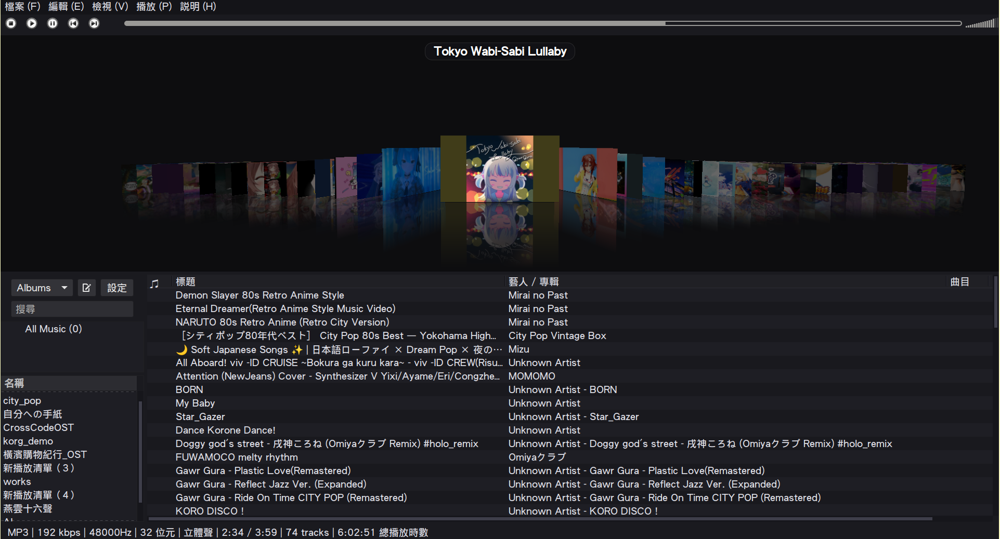

# DeaDBeeF with 3D OpenGL Cover Flow Plugin

[](COPYING)
[]()
[]()
[]()

**DeaDBeeF** 是一款在 Linux 上廣受推崇、極致輕量、啟動飛快且高度模組化的終極音樂播放器。

本專案為 DeaDBeeF GTK3 介面深度整合了原生的 **3D OpenGL Cover Flow 視差專輯封面外掛**，重現如經典 iTunes 般華麗流暢的立體翻頁互動，並針對現代高解析度寬螢幕（1080p+）與深色主題（Dark Theme）進行了專屬的視覺架構重構與體驗優化。

---

## 📸 視覺效果預覽 (Screenshot)



---

## ✨ Cover Flow 核心特色 (Features)

- 🚀 **原生 OpenGL 硬體加速渲染**
  基於 `GtkGLArea` 與 `libepoxy` 實作現代 OpenGL 渲染管線，具備 60 FPS 流暢物理慣性滑動與立體視差翻頁動畫。
- 🖼️ **長寬比自動維持（Aspect Ratio Preservation）**
  完美避免封面圖形拉伸或變形；支援各類非正方形封面，邊緣採用高質感透明漸變與深色底層無縫融合。
- 🏷️ **智慧專輯聚合（Smart Album Grouping）**
  智慧依據 `Album Title` 聚合曲目與專輯封面，多音軌或同名專輯自動歸整，杜絕重複圖示。
- 🎯 **浮動標題抬頭顯示（HUD Overlay）**
  選中的專輯名稱以半透明膠囊造型優雅懸浮於 3D 封面正上方，移除下方佔空間的傳統統計文字，最大化視覺工作區域。
- 💡 **立體光影與焦點突顯（Ambient Dimming & Dynamic Scaling）**
  中央當前選取的專輯封面以全光照耀並突顯；兩側未選中的專輯自然微縮並降低亮度（Ambient Dimming），營造深邃立體景深。
- 📐 **寬螢幕舒適非密集間距（Comfortable Staggered Spacing）**
  元件預設請求至少 $1080\text{px}$ 寬度視窗，中央與兩側封面間距經過精密設計，向兩側自然延伸並維持開闊間距，不再密集擁擠重疊。
- 🌙 **全域深色沉浸主題（Full Dark Theme Integration）**
  完整適配深色模式，CoverFlow 3D 舞台、播放清單分頁標籤、表格標頭欄位與選單皆呈現一體化的純黑高對比沉浸設計。
- ⚡ **非同步快取與低資源消耗**
  背景多執行緒非同步載入封面材質，即便面對數萬首歌曲的大型曲庫也能秒開且滑動不掉格。

---

## 🎮 操作方式 (Controls & Navigation)

| 操作方式 | 功能說明 |
| :--- | :--- |
| **滑鼠滾輪 (Scroll Up / Down)** | 向左 / 向右平滑翻動專輯 |
| **滑鼠左鍵點擊 (Single Click)** | 選中並將該專輯平滑滑動至舞台中央 |
| **滑鼠左鍵雙擊 (Double Click)** | 立即將該專輯載入播放，並從第一首歌曲開始播送 |
| **滑鼠按住拖曳 (Drag & Slide)** | 依拖曳速度自由平滑滑動瀏覽整座專輯庫 |
| **鍵盤方向鍵 (Left / Right Arrow)** | 往左 / 往右逐一切換相鄰專輯 |
| **鍵盤 Enter 鍵** | 立即播放目前中央選中的專輯 |

---

## 🛠️ 安裝與建置方式 (Installation & Build)

本專案提供多種靈活的安裝與建置方式：

### 方法一：安裝獨立打包好的 Debian / Ubuntu 套件（推薦）

若您使用的是 **Ubuntu 24.04 (noble)**、**Linux Mint 22.x** 或相容的 Debian 系列系統，可以直接安裝已編譯好的獨立 deb 套件。
本套件命名為 `deadbeef-coverflow`，安裝在獨立路徑，**絕不衝突** 系統原有的官方 `deadbeef` 套件：

```bash
# 1. 直接安裝預編譯 package
sudo dpkg -i deadbeef-coverflow_1.10.3-1~mint22.3_amd64.deb

# 2. 啟動播放器
deadbeef-coverflow
```

若您修改了原始碼，也可以隨時一鍵重新打包 deb：
```bash
./build_deb.sh
```

---

### 方法二：使用獨立腳本編譯 Cover Flow 外掛（適用現有 DeaDBeeF）

若您的系統上已經安裝了現有的 DeaDBeeF（例如透過 PPA、APT 或 Tarball 安裝），無需重新編譯整套播放器核心，只要使用獨立腳本編譯 Cover Flow 外掛本體即可：

#### 1. 安裝編譯相依套件
```bash
sudo apt update
sudo apt install -y build-essential pkg-config libgtk-3-dev libepoxy-dev
```

#### 2. 執行獨立編譯腳本
```bash
# 一鍵編譯並自動安裝至當前使用者的外掛目錄 (~/.local/lib/deadbeef)
./build_plugin.sh
```

`build_plugin.sh` 支援的進階選項：
```text
選項：
  -i, --install          安裝外掛至使用者目錄 (~/.local/lib/deadbeef) [預設]
  -s, --system           安裝外掛至全系統目錄 (/usr/lib/deadbeef，需 root/sudo)
  -d, --dest <DIR>       安裝至自訂目錄
  -n, --no-install       僅編譯產生 coverflow_gtk3.so，不執行複製
  -c, --clean            清理編譯暫存檔
  -h, --help             顯示說明訊息
```

---

### 方法三：從原始碼編譯全套 DeaDBeeF

若需自源碼編譯包含全部外掛的完整 DeaDBeeF：

```bash
# 1. 建立組態
./configure --prefix=/usr

# 2. 平行編譯
make -j$(nproc)

# 3. 安裝
sudo make install
```

---

## 💡 如何在 DeaDBeeF 中啟用 Cover Flow 元件

不論使用上述何種方式安裝，完成後請依照以下簡易步驟在介面中加入 Cover Flow：

1. **啟動播放器**：執行 `deadbeef` 或 `deadbeef-coverflow`。
2. **進入設計模式**：在頂部主選單點選 **檢視 (View)** -> 勾選 **設計模式 (Design Mode)**。
3. **新增 Cover Flow 元件**：
   - 在主畫面任一分割視窗或空白處點擊滑鼠右鍵。
   - 選擇 **插入新元件 (Insert New Widget)** -> 點選 **Cover Flow**。
4. **退出並儲存佈局**：再次點選選單中的 **檢視 (View)** -> 取消勾選 **設計模式 (Design Mode)**。
5. **開啟深色主題（建議）**：
   - 點選 **編輯 (Edit)** -> **偏好設定 (Preferences)** -> **GUI** 或 **外觀 (Appearance)**。
   - 勾選深色主題選項，即可享受與 Cover Flow 一體化沉浸式純黑視覺。

---

## 📦 系統與相依需求 (Prerequisites)

### 編譯 Cover Flow 外掛必備：
- **GCC / Clang** (支援 C99/C11)
- **Make**
- **pkg-config**
- **GTK+ 3.0 開發檔** (`libgtk-3-dev >= 3.20`)
- **Epoxy OpenGL 函式庫開發檔** (`libepoxy-dev >= 1.4`)

### 執行期環境：
- 支援 OpenGL 2.1+ / OpenGL 3.0+ 之顯示卡驅動程式（Intel、AMD、NVIDIA 均可）。

---

## 📄 授權條款 (License)

- **DeaDBeeF 核心與基礎模組**：採用 [ZLIB License](COPYING)。
- **Cover Flow 外掛元件**：採用 [GNU General Public License v2 (GPLv2)](COPYING.GPLv2)。
